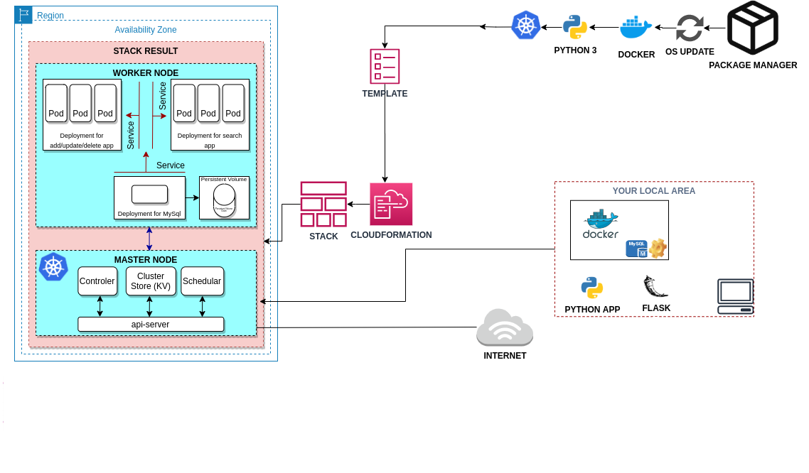

# Microservice Architecture for Phonebook Web Application (Python Flask) with MySQL using Kubernetes.

## Description

Phonebook Microservice Web Application aims to create a web application with MySQL Database using Docker and Kubernetes. In this application, we have a frontend service and a backend service to interact with database service. Each service will be managed by a Kubernetes deployment. The backend service will be a gateway for the application and it will serve the necessary web pages for create, delete and update operations while the frontend service will serve a search page in order to conduct read operations. To preserve the data in the database, persistent volume and persistent volume claim concepts should be adopted.

## Problem Statement

 

### Steps to Solution

- As a cloud engineer, you're requested to deploy the app on an AWS EC2 Instance using Docker and Kubernetes to showcase your project. In order to achieve this goal, you need to;

  - Pull the application code from GitHub repo of your team.

  - Create two docker images for create/update/delete and search pages using `Dockerfile`s.

  - Deploy the app using `Kubernetes`. To do so;

    - Create a database service using MySQL.

    - Use a custom network for the services.

- In the Kubernetes environment, you will configure three deployements with their services and a persistent volume for MySQL deployments. You can find the definitions below for the objects you should create:

  1.1. CREATE/DELETE/UPDATE DEPLOYMENT

    - Deployment definition file should configure create/delete/update operations with one or more replicas.
    - Expose the container port on `port 80`.
    - Deployment definition file should set the proper Environmental Variables for the db connection.
    - Passwords should be protected by kubernetes-secrets.
    - Database Host's value should be defined in the deployment using Kubernetes-ConfigMap.

  1.2. CREATE/DELETE/UPDATE SERVICE
    - This service should be attached to `CREATE/DELETE/UPDATE Deployment`.
    - Service type should be NodePort published on `port:30001`.
    - Expose the port and target port on port `80`.

  2.1. SEARCH DEPLOYMENT

    - Deployment definition file should configure search operations with one or more replicas.
    - Expose the container port on `port 80`.
    - Deployment definition file should set the proper Environmental Variables for the db connection.
    - Passwords should be protected by kubernetes-secrets.
    - Database Host's value should be defined in the deployment using Kubernetes-ConfigMap.

  2.2. SEARCH SERVICE
    - This service should be attached to `SEARCH Deployment`.
    - Service type should be NodePort published on `port:30002`.
    - Expose the port and target port on port `80`.

  3.1. DATABASE DEPLOYMENT
    - Deployment should use mysql:5.7 image pulled from Docker hub.
    - Expose the container port on `port 3306`.
    - Deployment definition file should set the proper Environmental Variables.
    - Persistent volume should be attached to this deployment.
    - Passwords should be protected by kubernetes-secrets.

  3.2. DATABASE SERVICE
    - This service should be attached to `DATABASE Deployment`.
    - Service type should be ClusterIP.
    - Expose the port and target port on port `3306`.

  3.3. Persistent Volume
    - Volume capacity should be set as `5Gi`.
    - Access Mode should be set as `ReadWriteOnce`.
    - Host path should be set as `/mnt/data`.
    - To be able to attache this volume, a persistent volume claim should be defined.
  
  4.1. Kubernetes Environment
  - Assign two EC2 machines as the project's infrastructure. One should be configured as the master and the other should be configured as the worker. 

  - Minimum `t2.medium` instance type should be selected.

  - The Web Application should be accessible via web browser from anywhere. 

  - The Application files should be downloaded from Github repo and deployed on EC2 Instance using user data script within cloudformation template.

## Resources

- [Kubernetes Documentations](https://kubernetes.io/docs/home/)
